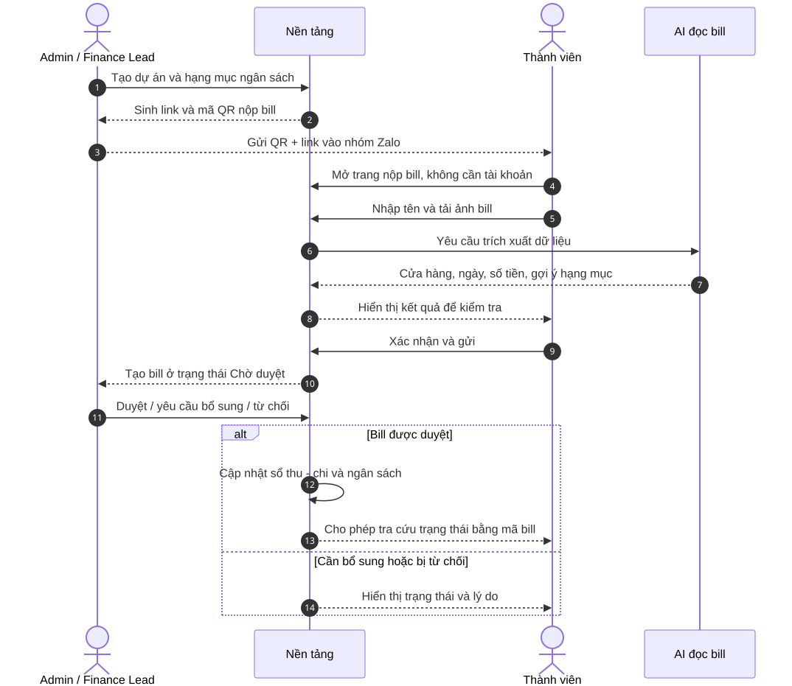

# Nền tảng quản lý chứng từ và minh bạch tài chính

> Từ ảnh bill rời rạc đến sổ thu - chi có kiểm duyệt theo thời gian thực.


## 1. Ý tưởng trong một câu

Đây là nền tảng dành cho CLB, nhóm thiện nguyện và dự án cộng đồng, nơi thành viên có thể nộp bill bằng link hoặc QR mà không cần tài khoản; AI hỗ trợ đọc bill; admin kiểm tra, phê duyệt và biến bill thành dữ liệu thu - chi tập trung, dễ tra cứu và minh bạch.

## 2. Vấn đề cần giải quyết

Trong nhiều dự án, bill và số liệu đang nằm ở nhiều nơi:

- Ảnh bill gửi trong Zalo hoặc Messenger rồi bị trôi.
- File ảnh được gom thủ công vào Drive.
- Số tiền được nhập lại bằng tay vào Sheets.
- Người phụ trách phải nhắc thành viên nhiều lần.
- Bill có thể mờ, thiếu thông tin, bị nhập trùng hoặc thất lạc.
- Lead khó biết chính xác ngân sách còn lại khi dự án đang diễn ra.
- Khi cần báo cáo, người phụ trách phải tìm và đối chiếu lại từ nhiều nguồn.

Insight trọng tâm cần kiểm chứng từ khảo sát:

> Làm báo cáo có thể chỉ mất một buổi, nhưng gom đủ bill lại mất cả tuần, có khi lâu hơn.

Các tỷ lệ phần trăm trong bản chuẩn bị khảo sát chỉ được dùng trong bài thi sau khi đã thu thập và xác minh là **kết quả khảo sát thật**.

## 3. Giải pháp chốt



Sản phẩm không thay thế phần mềm kế toán và không cố trở thành ngân hàng. Sản phẩm tập trung giải quyết đoạn công việc dễ đứt gãy nhất:

1. Thu bill ngay khi khoản chi vừa phát sinh.
2. Đưa tất cả bill về một nơi duy nhất.
3. Giảm nhập liệu thủ công bằng AI.
4. Giữ con người ở bước phê duyệt cuối cùng.
5. Chỉ dùng bill đã duyệt để cập nhật ngân sách và báo cáo.
6. Cho phép tra cứu lịch sử rõ ràng, có dấu vết ai gửi và ai duyệt.

## 4. Người sử dụng



### Admin / Finance Lead

Đây là người duy nhất cần đăng nhập trong MVP. Admin có thể:

- Tạo dự án và hạng mục ngân sách.
- Sinh link và QR nộp bill.
- Kiểm tra dữ liệu AI đã đọc.
- Duyệt, yêu cầu bổ sung hoặc từ chối bill.
- Xem số tiền đã chi, còn lại và các cảnh báo.
- Tìm kiếm, xuất báo cáo và hỏi chatbot.

Trong prototype có thể chỉ có một tài khoản admin. Khi mô tả sản phẩm dài hạn, nên nói **mỗi tổ chức hoặc dự án có Finance Admin riêng**, không phải toàn hệ thống chỉ có một tài khoản.

### Thành viên nộp bill

Thành viên không cần tạo tài khoản:

- Mở link trực tiếp từ Zalo hoặc quét QR.
- Nhập tên người gửi và, nếu cần, tên người thanh toán.
- Tải ảnh bill.
- Kiểm tra thông tin AI đã đọc trước khi gửi.
- Nhận mã bill để xem trạng thái.

Vì không đăng nhập, tên người gửi là **thông tin tự khai**, không phải danh tính đã được xác minh.

### Lead, thành viên hoặc nhà tài trợ

Tùy chính sách dự án, nhóm có thể chia sẻ một trang minh bạch chỉ hiển thị các khoản đã duyệt. Thông tin cá nhân, số tài khoản và dữ liệu nhạy cảm phải được che trước khi công khai.

## 5. Hành trình từ QR đến báo cáo



### Bước 1 - Admin tạo dự án

Admin nhập tên dự án, thời gian, tổng ngân sách và các hạng mục như truyền thông, hậu cần, vận chuyển hoặc quà tặng.

### Bước 2 - Hệ thống sinh QR và link

Ví dụ:

```text
https://example.vn/contribute/pj_8fK29xQm
```

Admin gửi cả QR và link vào nhóm Zalo. Link thuận tiện khi thành viên đang dùng chính điện thoại; QR thuận tiện khi quét từ máy khác hoặc quét từ ảnh.

Link công khai chỉ dẫn đến trang nộp bill của đúng dự án. Nó không cấp quyền quản trị và không xác định danh tính người nộp.

### Bước 3 - Thành viên nộp bill

Thông tin tối thiểu gồm:

- Tên người gửi bill.
- Tên người thanh toán, nếu khác người gửi.
- Ảnh bill hoặc chứng từ.
- Nội dung hoặc mục đích khoản chi.

### Bước 4 - AI hỗ trợ đọc bill

AI đề xuất:

- Tên cửa hàng hoặc đơn vị xuất bill.
- Ngày giao dịch.
- Tổng số tiền.
- Số hóa đơn, nếu có.
- Hạng mục ngân sách phù hợp.

Người gửi phải kiểm tra lại vì AI có thể đọc sai ảnh mờ, chữ viết tay hoặc mẫu bill lạ.

### Bước 5 - Admin kiểm duyệt

Bill mới luôn ở trạng thái **Chờ duyệt**. Admin có ba lựa chọn:

- **Duyệt:** bill hợp lệ và được ghi nhận.
- **Yêu cầu bổ sung:** thiếu ảnh hoặc thông tin chưa rõ.
- **Từ chối:** bill không hợp lệ, trùng hoặc không thuộc dự án.

### Bước 6 - Cập nhật minh bạch

Chỉ bill đã duyệt mới:

- Trừ vào hạng mục ngân sách.
- Xuất hiện trong sổ thu - chi.
- Được tính vào dashboard và báo cáo.
- Trở thành dữ liệu để chatbot trả lời.

## 6. Vòng đời của một bill



Trạng thái nghiệp vụ đề xuất:

| Trạng thái | Ý nghĩa |
|---|---|
| Đang nhập liệu | Người gửi chưa hoàn tất |
| Chờ duyệt | Đã gửi, đang chờ admin kiểm tra |
| Cần bổ sung | Thiếu hoặc chưa rõ thông tin |
| Bị từ chối | Không hợp lệ hoặc không thuộc dự án |
| Đã duyệt | Admin chấp nhận chứng từ |
| Đã ghi nhận | Đã cập nhật vào ngân sách và sổ thu - chi |

### Duyệt bill không đồng nghĩa xác nhận ngân hàng

Ảnh bill và ảnh chuyển khoản là bằng chứng do người dùng cung cấp. Khi admin duyệt, hệ thống chỉ xác nhận rằng chứng từ được tổ chức chấp nhận về mặt nội bộ.

Nếu sau này cần xác minh giao dịch ngân hàng, sản phẩm phải đối soát sao kê hoặc tích hợp chính thức với cổng thanh toán. Chức năng này không nằm trong MVP.

## 7. Chatbot làm gì?

Chatbot là một cách tương tác thuận tiện, không phải toàn bộ sản phẩm.

Người dùng có thể:

- Gửi ảnh bill ngay trong cuộc trò chuyện.
- Hỏi: “Tháng này dự án đã chi bao nhiêu?”
- Hỏi: “Còn bao nhiêu ngân sách truyền thông?”
- Hỏi: “Có bill nào của Bảo Anh đang chờ duyệt?”
- Hỏi trạng thái bằng mã bill.

Chatbot chỉ trả lời từ dữ liệu được phép xem. Người không có quyền không được thấy bill chờ duyệt, thông tin liên hệ hoặc dữ liệu nhạy cảm.

Giai đoạn đầu chưa cần xây một hệ thống tri thức phức tạp. Chatbot hiểu câu hỏi và sử dụng các chức năng truy vấn đã được kiểm soát của nền tảng.

## 8. Phạm vi MVP



### Bắt buộc có

- Admin đăng nhập.
- Tạo dự án, ngân sách và hạng mục.
- Sinh link và QR nộp bill.
- Thành viên nộp bill không cần tài khoản.
- AI đọc các trường cơ bản trên bill.
- Người gửi xác nhận dữ liệu AI.
- Admin duyệt, yêu cầu bổ sung hoặc từ chối.
- Dashboard ngân sách và danh sách bill.
- Tìm kiếm và xuất báo cáo cơ bản.
- Chatbot hỏi dữ liệu đã duyệt.

### Nên có nếu còn thời gian

- Phát hiện bill có khả năng bị trùng.
- Cảnh báo hạng mục gần hoặc vượt ngân sách.
- Trang minh bạch công khai có che dữ liệu nhạy cảm.
- Mã theo dõi bill cho người không đăng nhập.

### Chưa làm trong MVP

- Xác minh ngân hàng hoặc ví điện tử.
- Zalo OA và webhook nhận bill tự động.
- Nhiều cấp phê duyệt phức tạp.
- Ứng dụng mobile riêng.
- Hệ thống kế toán, hóa đơn điện tử hoặc khai thuế đầy đủ.
- Hạ tầng phân tán phục vụ lượng người dùng rất lớn.

## 9. Nguyên tắc sản phẩm

1. **Không cần tài khoản cho người nộp:** giảm tối đa rào cản sử dụng.
2. **Một nguồn dữ liệu tập trung:** không tiếp tục chia bill và số liệu thành nhiều nơi.
3. **AI hỗ trợ, con người quyết định:** AI không tự ý phê duyệt khoản chi.
4. **Minh bạch có kiểm soát:** chỉ công khai dữ liệu đã duyệt và đã che thông tin nhạy cảm.
5. **Dễ dùng trước, nhiều tính năng sau:** MVP chứng minh quy trình cốt lõi trước khi tích hợp ngân hàng hoặc Zalo OA.

## 10. Điểm khác biệt của sản phẩm

USP không nên chỉ là “AI đọc bill”, vì OCR có thể được nhiều công cụ cung cấp.

> Điểm khác biệt là một quy trình khép kín: nộp bill không cần tài khoản → AI số hóa → người gửi xác nhận → admin kiểm duyệt → ngân sách và báo cáo được cập nhật → dữ liệu được minh bạch có kiểm soát.

## 11. Kịch bản demo đề xuất

1. Admin tạo dự án “Chiến dịch Mùa hè xanh 2026” với ngân sách 30 triệu đồng.
2. Hệ thống sinh QR và link; admin gửi vào nhóm Zalo.
3. Một thành viên mở link, nhập tên và tải bill 450.000 đồng.
4. AI đọc cửa hàng, ngày, số tiền và đề xuất hạng mục “Vật tư”.
5. Thành viên sửa một trường bị đọc sai rồi gửi.
6. Admin thấy bill trong hàng chờ, mở ảnh và duyệt.
7. Dashboard cập nhật số tiền đã chi và ngân sách còn lại.
8. Teammate hỏi chatbot: “Dự án đã chi bao nhiêu cho vật tư?”
9. Chatbot trả lời từ các bill đã duyệt và dẫn đến danh sách liên quan.

Kịch bản này thể hiện trọn giá trị của MVP mà không cần trình bày công nghệ phía sau.

## 12. Câu nói chốt khi trình bày

> Chúng ta không xây thêm một nơi để cất ảnh bill. Chúng ta xây một quy trình giúp bill được thu đúng lúc, đọc nhanh, kiểm duyệt rõ ràng và biến thành dữ liệu tài chính có thể tin cậy để ra quyết định.

## 13. Nơi lưu các tài liệu liên quan

```text
external/
├── 01-product/       # Requirement và product brief
├── 02-research/      # Khảo sát
├── 03-design/        # Mermaid và UI snapshots
├── 04-costing/       # Estimate chi phí
├── 05-pricing/       # Giá bán và package
├── 06-deliverables/  # PDF hoàn chỉnh
└── 99-archive/       # Source LaTeX cũ
```

Lệnh dựng lại diagram và PDF từ thư mục `external/99-archive/latex-product-brief`:

```bash
npm install
npm run build
```
